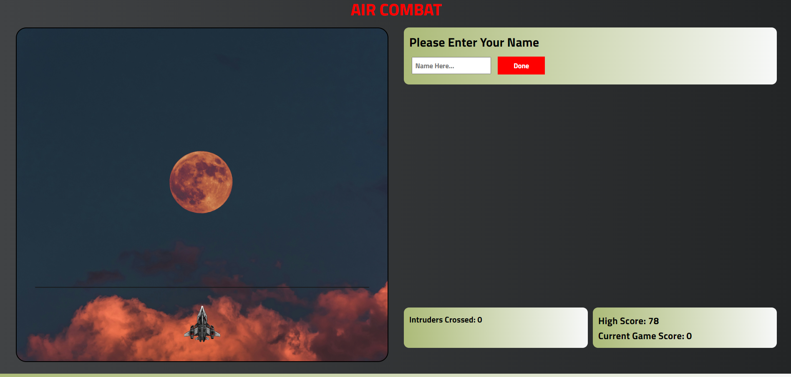
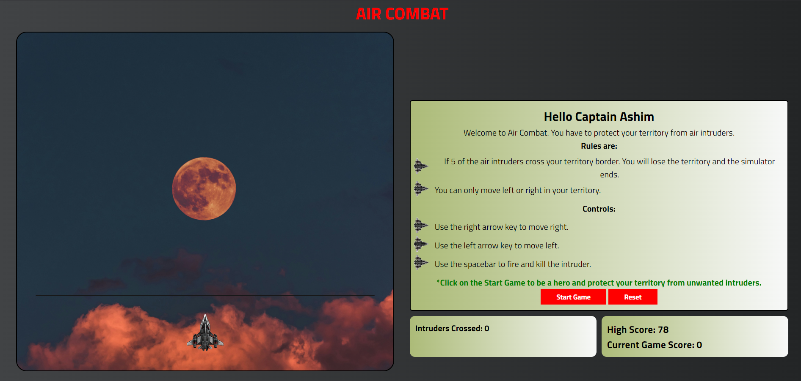

<h1>🔥🛩️AIR COMBAT🛩️🔥</h1>
<h2>A SVG-powered Javascript game.</h2>
<h2>Rule the skies in this thrilling air combat experience</h2>
<h3>Features</h3>
<ul>
<li>Fire upon the intruders raiding your territory.</li>
<li>Kill as many intruders you see.</li>
<li>If a certain number of intruders cross your territory, you lose.</li>
<li>Leveraging the power of LocalHost to store the User High Score for future gameplays.</li>
</ul>
 

 
<h4>Showing personalized message to the captain along with the instructions and rules for the game.</h4>
 

 
<h2>To Play the game</h2>
<h4>Option 1</h4>

git clone https://github.com/ashimsharma/air-combat.git

Run the above command and clone the project in your local IDE and run the HTML file on the localhost or simply opening the HTML file inside a browser.

<h4>Option 2</h4>

<a href="https://ashimsharma.github.io/air-combat">Play Game</a>

Click the link and enjoy the game.

&copy;Ashim Sharma
